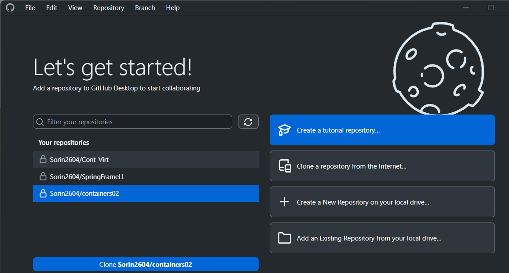
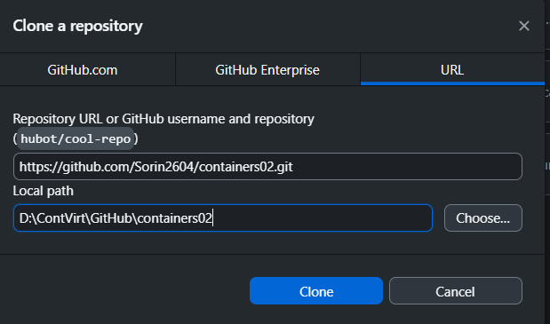
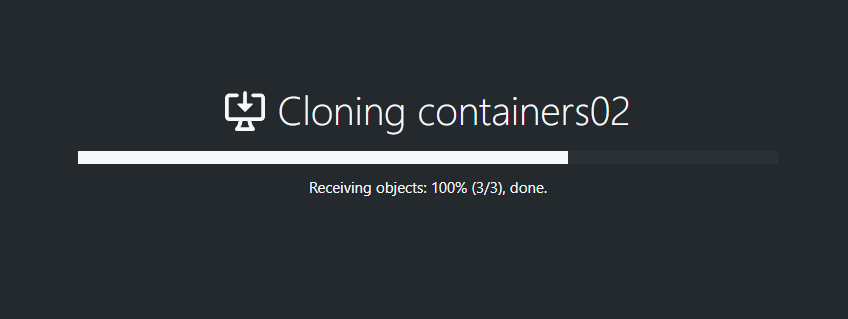
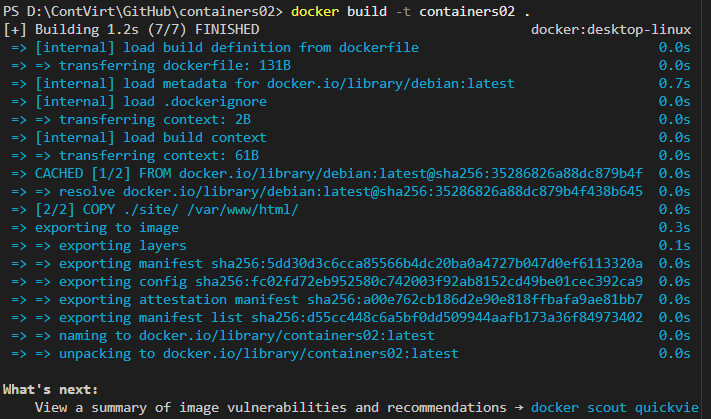
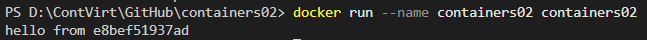
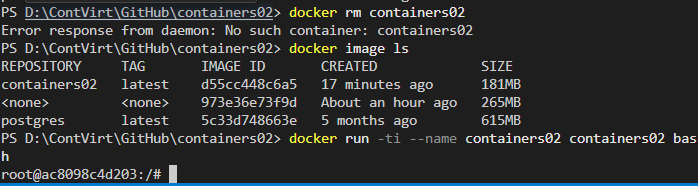
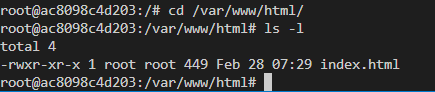

# Lucrarea de laborator nr.3
## containers02
### Crearea repozitorului pe GitHub si clonarea sa pe computer prin GitHub Dekstop.
Am creat un nou repositoriu pe GitHub, care automat sa salvat si pe versiunea dekstop.
   

Facem clonarea repositorului pe desktop, pentru asta intram pe GH desktop si clonam repozitoriul.



### Lucrul cu `Dockerfile`
Am creat fisierul `dockerfile`, si introduc in el urmatorul continut
```
FROM debian:latest
COPY ./site/ /var/www/html/
CMD ["sh", "-c", "echo hello from $HOSTNAME"]
```

Deschid terminalul pentru directorul `containers02` si execut comanda de construire a imaginii docker

Procesul de construire a durat 11 milisecunde

Creez direcotrul `site` in care creez un fisier html 


In continuare voi executa comanda pentru a porni containerul
```
docker run --name containers03 containers03
```


Aceasta comanda la pornire va numi containerul "conatiners02" si la afisare va afisa ceea ce era in `CMD`, si vloarea variabilei `$HOSTNAME` .

Dupa prin comanda `docker rm conatainers02` stergem containerul si il repornim din nou prin alta comanda in care il redenumim si deschidem shell-ul.


In fereastra root introducem comenzile:
```sh
cd /var/www/html/
ls -l
```
Care ne va schimba directorul curent in `/var/www/html/`
si va afisa lista directoarelor din directorul curent si permisiunile pentru fiecare utilizator la ea.



## Concluzie 
In urma acestei lucrari am studiat regulile fundamnetale pentru crearea unui container din imagine, din care  in concluzie am inteles cat trebuie defapt de lucrat pentru a avea un container configurat cu succes, cu toate ca eu nu sunt sigur daca ceea ce am facut este destul pentru aceasta.
